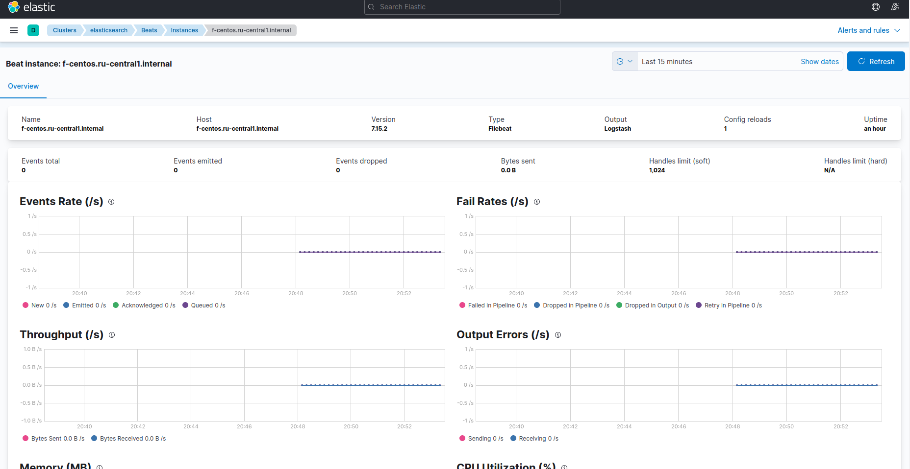
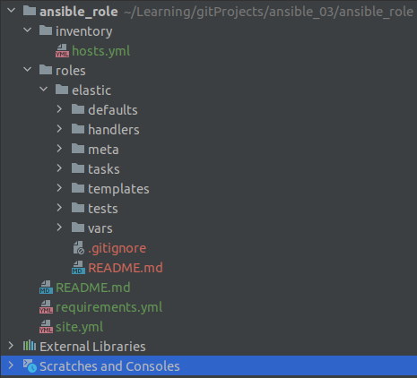
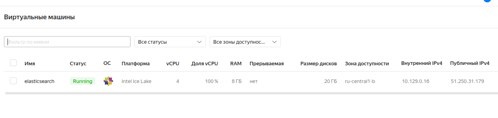
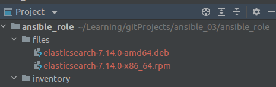
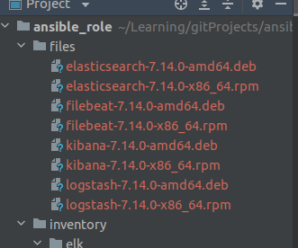
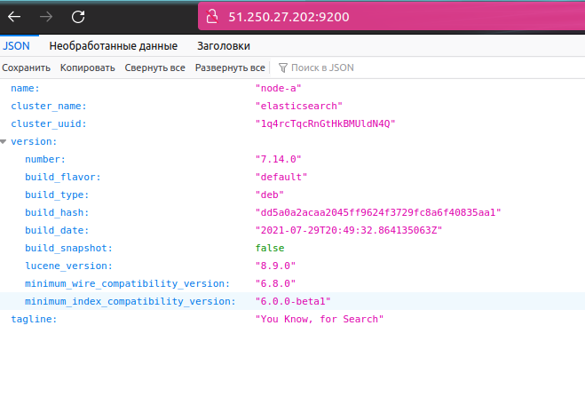
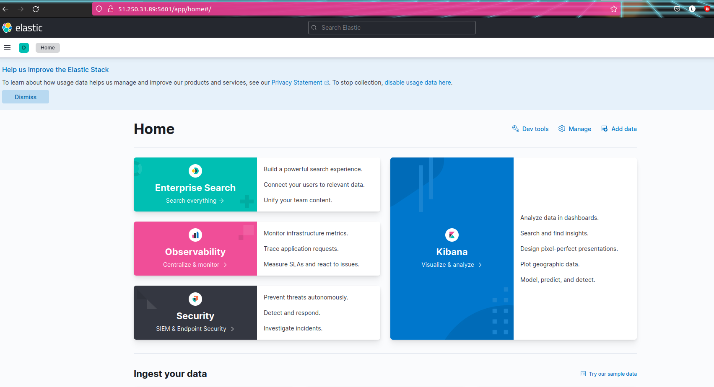
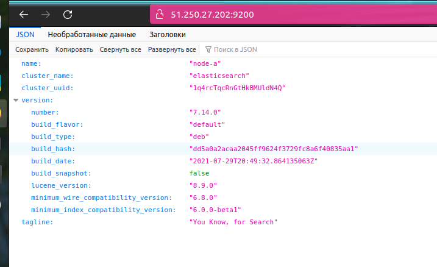
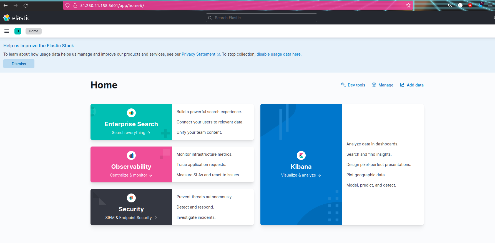
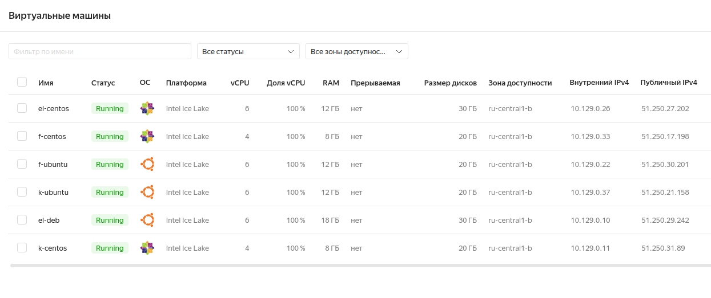

# Домашнее задание к занятию "8.4 Работа с Roles"

---------------------------------------------------------
#### Работа принята, получен ответ от преподавателя Андрея Копылова:

Добрый день!

Спасибо за выполнение ДЗ. Все сделано отлично.

Про `logstash`:
Судя по логам для старта logstash не хватает конфигов.
Типичный набор конфигов:

1. /usr/share/logstash/config/logstash.yml - конфиг для подключения к elasticsearch
2. /usr/share/logstash/config/pipelines.yml - описание pipelines
3. /usr/share/logstash/pipeline/ - папка с pipelines

У Вас есть описание только одного pipeline, его может и хватить. Но это я не проверял.
В такой ситуации логично сделать сначала конфигурирование, а только потом запуск.

```yaml
- import_tasks: precheck.yml
- include_tasks: "download_{{ ansible_facts.pkg_mgr }}.yml"
- import_tasks: configure.yml
- include_tasks: "install_{{ ansible_facts.pkg_mgr }}.yml"
```

Или после установки не делать запуск. Запуск делать только после конфигурации.

---------------------------------------------------------
## По комментарию задание было доработано. В итоге:
  * Сменила версию в группе ролей с `7.14.0` на `7.15.2`. Вынуждена была сделать так из-за проблем с `java` при работе с `logstash`.
  * В роль `logstash` добавлены конфиги, она переработана [README.md](https://github.com/lereklerik/logstash-role#role-name) (спойлер: с этой ролью не получилось, в конце **_этого_** файла `README.md` описаны результаты)
  * Роль `filebeat` также доработана
  * Выполняла на трех хостах с `centos`, в другие хосты конфиги дублировала. Последний успешный [лог](netology/ansible-playbook8.log)



---------------------------------------------------------


#### Подготовка

* Репозитории:
  * _**Kibana**_ [README.md](https://github.com/lereklerik/kibana-role#role-name)
  * _**Filebeat**_ [README.md](https://github.com/lereklerik/filebeat-role#role-name)
  * _**Logstash**_ [README.md](https://github.com/lereklerik/logstash-role#role-name) (спойлер: с этой ролью не получилось, в конце **_этого_** файла `README.md` описаны результаты)

----------------------------------------------
## Основная часть

### 1. Создать в старой версии playbook файл `requirements.yml`: 

* Создан, на этот момент времени `requirements.yml: `
```shell
 $ cat requirements.yml 
---
  - src: git@github.com:netology-code/mnt-homeworks-ansible.git
    scm: git
    version: "2.0.0"
    name: elastic
```

### 2. При помощи `ansible-galaxy` скачать себе эту роль.

```shell
 $ ansible-galaxy install -r requirements.yml -p roles
Starting galaxy role install process
- extracting elastic to /home/lerekler/Learning/gitProjects/ansible_03/ansible_role/roles/elastic
- elastic (2.0.0) was installed successfully
```


* Развернула ВМ на `centos 7` в яндексе. `hosts.yml`:



```shell
/inventory/elk $ cat hosts.yml 
---
elasticsearch:
  hosts:
    elastic:
      ansible_host: 51.250.31.179 ## yandex VM
      ansible_connection: ssh
```
* `site.yml`:
```shell
$ cat site.yml 
---
- name: Work with elasticsearch-role
  hosts: elasticsearch
  roles:
    - elastic
```
* `ansible-playbook -i inventory/elk/ site.yml `:
```shell
$ ansible-playbook -i inventory/elk/ site.yml 

PLAY [Work with elasticsearch-role] *******************************************************************************************************************************************************************************************************

TASK [Gathering Facts] ********************************************************************************************************************************************************************************************************************
ok: [elastic]

TASK [elastic : Fail if unsupported system detected] **************************************************************************************************************************************************************************************
skipping: [elastic]

TASK [elastic : include_tasks] ************************************************************************************************************************************************************************************************************
included: /home/lerekler/Learning/gitProjects/ansible_03/ansible_role/roles/elastic/tasks/download_yum.yml for elastic

TASK [elastic : Download Elasticsearch's rpm] *********************************************************************************************************************************************************************************************
changed: [elastic -> localhost]

TASK [elastic : Copy Elasticsearch to managed node] ***************************************************************************************************************************************************************************************
changed: [elastic]

TASK [elastic : include_tasks] ************************************************************************************************************************************************************************************************************
included: /home/lerekler/Learning/gitProjects/ansible_03/ansible_role/roles/elastic/tasks/install_yum.yml for elastic

TASK [elastic : Install Elasticsearch] ****************************************************************************************************************************************************************************************************
changed: [elastic]

TASK [elastic : Configure Elasticsearch] **************************************************************************************************************************************************************************************************
changed: [elastic]

RUNNING HANDLER [elastic : restart Elasticsearch] *****************************************************************************************************************************************************************************************
changed: [elastic]

PLAY RECAP ********************************************************************************************************************************************************************************************************************************
elastic                    : ok=8    changed=5    unreachable=0    failed=0    skipped=1    rescued=0    ignored=0   
```
* Добавила ещё две ВМ, изменила `hosts.yml`:
```shell
 $ cat inventory/elk/hosts.yml 
---
centos:
  hosts:
    elastic:
      ansible_host: 51.250.31.179
      ansible_connection: ssh
    el-centos:
      ansible_host: 51.250.26.45
      ansible_connection: ssh
debian:
  hosts:
    el-deb:
      ansible_host: 51.250.27.202
      ansible_connection: ssh
```
* и `site.yml`:
```shell
---
- name: Work with elasticsearch-role
  hosts: all
  roles:
    - elastic
```

* `ansible-playbook`:
```shell
 $ ansible-playbook -i inventory/elk/ site.yml 

PLAY [Work with elasticsearch-role] *******************************************************************************************************************************************************************************************************

TASK [Gathering Facts] ********************************************************************************************************************************************************************************************************************
ok: [el-centos]
ok: [el-deb]
ok: [elastic]

TASK [elastic : Fail if unsupported system detected] **************************************************************************************************************************************************************************************
skipping: [elastic]
skipping: [el-centos]
skipping: [el-deb]

TASK [elastic : include_tasks] ************************************************************************************************************************************************************************************************************
included: /home/lerekler/Learning/gitProjects/ansible_03/ansible_role/roles/elastic/tasks/download_yum.yml for elastic, el-centos
included: /home/lerekler/Learning/gitProjects/ansible_03/ansible_role/roles/elastic/tasks/download_apt.yml for el-deb

TASK [elastic : Download Elasticsearch's rpm] *********************************************************************************************************************************************************************************************
ok: [elastic -> localhost]
ok: [el-centos -> localhost]

TASK [elastic : Copy Elasticsearch to managed node] ***************************************************************************************************************************************************************************************
ok: [elastic]
changed: [el-centos]

TASK [elastic : Download Elasticsearch's deb] *********************************************************************************************************************************************************************************************
changed: [el-deb -> localhost]

TASK [elastic : Copy Elasticsearch to manage host] ****************************************************************************************************************************************************************************************
changed: [el-deb]

TASK [elastic : include_tasks] ************************************************************************************************************************************************************************************************************
included: /home/lerekler/Learning/gitProjects/ansible_03/ansible_role/roles/elastic/tasks/install_yum.yml for elastic, el-centos
included: /home/lerekler/Learning/gitProjects/ansible_03/ansible_role/roles/elastic/tasks/install_apt.yml for el-deb

TASK [elastic : Install Elasticsearch] ****************************************************************************************************************************************************************************************************
ok: [elastic]
changed: [el-centos]

TASK [elastic : Install Elasticsearch] ****************************************************************************************************************************************************************************************************
changed: [el-deb]

TASK [elastic : Configure Elasticsearch] **************************************************************************************************************************************************************************************************
ok: [elastic]
changed: [el-deb]
changed: [el-centos]

RUNNING HANDLER [elastic : restart Elasticsearch] *****************************************************************************************************************************************************************************************
changed: [el-deb]
changed: [el-centos]

PLAY RECAP ********************************************************************************************************************************************************************************************************************************
el-centos                  : ok=8    changed=4    unreachable=0    failed=0    skipped=1    rescued=0    ignored=0   
el-deb                     : ok=8    changed=5    unreachable=0    failed=0    skipped=1    rescued=0    ignored=0   
elastic                    : ok=7    changed=0    unreachable=0    failed=0    skipped=1    rescued=0    ignored=0  
```
* Файлы: 



* На примере одного хоста проверим статус сервиса (для `ubuntu` выделила 12Гб оперативки):
```shell
$ ssh 51.250.27.202
Welcome to Ubuntu 20.04.3 LTS (GNU/Linux 5.4.0-42-generic x86_64)

 * Documentation:  https://help.ubuntu.com
 * Management:     https://landscape.canonical.com
 * Support:        https://ubuntu.com/advantage
Last login: Sat Dec 11 10:07:27 2021 from 46.138.247.252
lerekler@el-deb:~$ systemctl status elasticsearch
● elasticsearch.service - Elasticsearch
     Loaded: loaded (/lib/systemd/system/elasticsearch.service; disabled; vendor preset: enabled)
     Active: active (running) since Sat 2021-12-11 10:07:43 UTC; 45min ago
       Docs: https://www.elastic.co
   Main PID: 1279 (java)
      Tasks: 68 (limit: 14309)
     Memory: 6.4G
     CGroup: /system.slice/elasticsearch.service
             ├─1279 /usr/share/elasticsearch/jdk/bin/java -Xshare:auto -Des.networkaddress.cache.ttl=60 -Des.networkaddress.cache.negative.ttl=10 -XX:+AlwaysPreTo>
             └─1482 /usr/share/elasticsearch/modules/x-pack-ml/platform/linux-x86_64/bin/controller
```
-----------------------------------------------------------------------
### 3-8. Создайте новые роли `kibana`, `filebeat`. На основе `tasks` заполните новые роли, перенесите нужные шаблоны конфигов в `templates`.
### 9-10. Опишите роли в README.md и выложите в репозитории

* Создание роли выполняю в таком алгоритме:
  * Раскидываю все задачи и необходимые данные по нужным файлам и каталогам;
  * Выкладываю в репозитории;
  * Изменяю основной `playbook`, тестирую с добавленным ролями 
----------------------------------------
* Чтобы не лишать `README.md` читаемого вида, вынесла логи по настройке ролей в отдельные файлы (конечно, после этого они дорабатывались, что отражено в репозитории и измененных версий тегов):
  * _**KIBANA**_ [Лог](netology/kibana/log.md), [README.md](https://github.com/lereklerik/kibana-role#role-name) в репозитории
  * _**FILEBEAT**_ [Лог](netology/filebeat/log.md), [README.md](https://github.com/lereklerik/filebeat-role#role-name) в репозитории


* `inventory/hosts.yml` был изменен (удален один хост с `elastic` в блоке `centos`):
```yaml
---
centos:
  hosts:
    el-centos:
      ansible_host: 51.250.26.45
      ansible_connection: ssh
debian:
  hosts:
    el-deb:
      ansible_host: 51.250.27.202
      ansible_connection: ssh
```

-----------------------------------------------------------------------

### 11. Добавьте roles в `requirements.yml` в playbook.

```yaml
---
  - src: git@github.com:netology-code/mnt-homeworks-ansible.git
    scm: git
    version: "2.0.0"
    name: elastic
  - src: git@github.com:lereklerik/kibana-role.git
    scm: git
    version: "1.0.0"
    name: kibana
  - src: git@github.com:lereklerik/filebeat-role.git
    scm: git
    version: "1.0.0"
    name: filebeat
  - src: git@github.com:lereklerik/logstash-role.git
    scm: git
    version: "1.0.0"
    name: logstash
```
```shell
 $ ansible-galaxy install -r requirements.yml -p roles
Starting galaxy role install process
- elastic (2.0.0) is already installed, skipping.
- extracting kibana to /home/lerekler/Learning/gitProjects/ansible_03/ansible_role/roles/kibana
- kibana (1.0.0) was installed successfully
- extracting filebeat to /home/lerekler/Learning/gitProjects/ansible_03/ansible_role/roles/filebeat
- filebeat (1.0.0) was installed successfully
- extracting logstash to /home/lerekler/Learning/gitProjects/ansible_03/ansible_role/roles/logstash
- logstash (1.0.0) was installed successfully
```

### 12. Переработайте playbook на использование roles.

* Доработанный `playbook` - конечный результат, который можно видеть в этом репозитории.
  * [hosts.yml](inventory/elk/hosts.yml)
  * [site.yml](site.yml)
  * По [requirements](requirements.yml) можно увидеть, сколько раз я меняла ту или иную роль. Банально были порой опечатки, их не привожу.
------------------------------------------------------------------
* Роли обновляла по тегам командой `ansible-galaxy install -r requirements.yml -p roles --force`
* `Playbook` запускала командой `ansible-playbook -i inventory/elk/ site.yml &> ansible-playbook<номер лога>.log`
------------------------------------------------------------------
* В качестве типичной ошибки (для меня) приведу следующую: в [kibana.yml.j2](roles/kibana/templates/kibana.yml.j2) вместо `elasticsearch.hosts` я писала `centos.hosts` или `debian.hosts`. Ошибка возникала на этапе загрузки `dashboard`:
```shell
"Loading dashboards (Kibana must be running and reachable)"
```
* [Лог](netology/ansible-playbook.log) с примером ошибки
* Конечно, мне пришлось забежать на сервера и посмотреть, что там с сервисами, ответ был очевидным.
-----------------------------------------------------------------
* Итоговый безошибочный лог [тут](netology/ansible-playbook4.log)

-----------------------------------------------------------------
#### Картинки:

* Файлы:



* Проверяем доступность серверов `centos`:
* `el-centos`:



* `k-centos`:



* Проверяем доступность серверов `debian/ubuntu`:
* `el-deb`:



* `k-deb`:



* список ВМ



------------------------------------------------------
## Необязательная часть

##### Совсем, думаю, не получилось, т.к. с первого пункта не продвинулась :(

  * _**LOGSTASH**_ [Лог](netology/logstash/log.md), [README.md](https://github.com/lereklerik/logstash-role#role-name) в репозитории
  * Долго пыталась победить ошибки с `logstash`, но так и не смогла. [Сначала](netology/ansible-playbook2.log) предполагала, что связаны они с недостатком оперативной памяти. Удалила прошлый хосты, развернула новые оптимизированные; перезапустила `playbook` с измененными хостами для `elasticsearch`, проверив идемпотентность =). Но проблему это [не решило](netology/ansible-playbook3.log)
  * Поэтому задачу я закомментировала, и выполнила без `logstash`. Буду рада получить комментарий к ошибкам, которые возникли с этой ролью.
