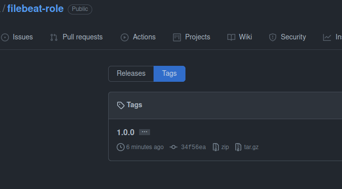

# Работа с `filebeat-role`

## 1. Создать новый каталог с ролью при помощи `ansible-galaxy role init filebeat-role`.

```shell
$ ansible-galaxy role init filebeat-role
- Role filebeat-role was created successfully
```

## 2. На основе tasks из старого playbook заполните новую role. Разнесите переменные между `vars` и `default`.

* В `vars` остановимся на поддерживаемых системах:
```shell
 $ cat vars/main.yml 
---
supported_systems: ['CentOS', 'Ubuntu', 'Debian']
```
* Версия `filebeat` в `defaults`:
```shell
$ cat defaults/main.yml 
---
filebeat_version: "7.15.2"
filebeat_install_type: remote
```
##### Распределим задачи:
* `handlers/main.yml`:
```yaml
---
- name: restart filebeat
  become: true
  service:
    name: filebeat
    state: restarted
```
* `configure.yml`:
```yaml
---
- name: Configure Filebeat
  become: true
  template:
    src: filebeat.yml.j2
    dest: /etc/filebeat/filebeat.yml
    mode: 0644
```
* `download_apt`:
```yaml
---
- name: "Download Filebeat's deb"
  get_url:
    url: "https://artifacts.elastic.co/downloads/beats/filebeat/filebeat-{{ filebeat_version }}-amd64.deb"
    dest: "/files/filebeat-{{ filebeat_version }}-amd64.deb"
  delegate_to: localhost
  register: download_filebeat
  until: download_filebeat is succeeded
  when: filebeat_install_type == 'remote'
- name: Copy Filebeat to manage host
  copy:
    src: "files/filebeat-{{ filebeat_version }}-amd64.deb"
    mode: 0755
    dest: "/tmp/filebeat-{{ filebeat_version }}-amd64.deb"
```

* `download_yum`:
```yaml
---
- name: "Download Kibana's rpm"
  get_url:
    url: "https://artifacts.elastic.co/downloads/beats/filebeat/filebeat-{{ filebeat_version }}-x86_64.rpm"
    dest: "/tmp/filebeat-{{ filebeat_version }}-x86_64.rpm"
  register: download_filebeat
  delegate_to: localhost
  until: download_filebeat is succeeded
  when: filebeat_install_type == 'remote'
- name: Copy Filebeat to managed node
  copy:
    src: "files/filebeat-{{ filebeat_version }}-x86_64.rpm"
    mode: 0755
    dest: "/tmp/filebeat-{{ filebeat_version }}-x86_64.rpm"
```

* `install_apt.yml`:
```yaml
---
- name: Install Filebeat
  become: true
  apt:
    deb: "/tmp/filebeat-{{ filebeat_version }}-amd64.deb"
    state: present
```

* `install_yum`:
```yaml
---
- name: Install Filebeat
  become: true
  yum:
    name: "/tmp/filebeat-{{ filebeat_version }}-x86_64.rpm"
    state: present
```

* `precheck.yml` оставим тот же, что у `elastic`:
```yaml
---
- name: Fail if unsupported system detected
  fail:
    msg: "System {{ ansible_distribution }} is not support by this role"
  when: ansible_distribution not in supported_systems
```

* `main.yml` в `tasks`:
```yaml
---
- import_tasks: precheck.yml
- include_tasks: "download_{{ ansible_facts.pkg_mgr }}.yml"
- include_tasks: "install_{{ ansible_facts.pkg_mgr }}.yml"
- import_tasks: configure.yml
```

## 3. Перенести нужные шаблоны конфигов в `templates`.
* Пока сделала условное выражение для `centos` и `ubuntu/debian` в таком формате:
```shell
$ cat filebeat.yml.j2 
```
```yaml

output.centos:
  hosts: ["http://{{ hostvars['el-centos']['ansible_facts']['default_ipv4']['address'] }}:9200"]
setup.centos:
  host: "http://{{ hostvars['k-centos']['ansible_facts']['default_ipv4']['address'] }}:5601"

output.ubuntu:
  hosts: ["http://{{ hostvars['el-ubuntu']['ansible_facts']['default_ipv4']['address'] }}:9200"]
setup.ubuntu:
  host: "http://{{ hostvars['k-ubuntu']['ansible_facts']['default_ipv4']['address'] }}:5601"

filebeat.config.modules.path: ${path.config}/modules.d/*.yml
```
## 4. Описать в `README.md` роль и её параметры. Выложите в репозиторий. Проставьте тэги, используя семантическую нумерацию.

* Ссылка на [README.md](https://github.com/lereklerik/filebeat-role#role-name)
 
