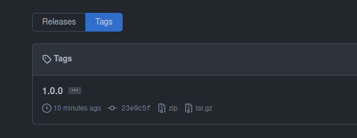

# Работа с `kibana-role`

## 1. Создать новый каталог с ролью при помощи `ansible-galaxy role init kibana-role`.

```shell
 $ ansible-galaxy role init kibana-role
- Role kibana-role was created successfully
```

## 2. На основе tasks из старого playbook заполните новую role. Разнесите переменные между `vars` и `default`.

* В `vars` остановимся на поддерживаемых системах:
```shell
$ cat vars/main.yml 
---
supported_systems: ['CentOS', 'Ubuntu', 'Debian']
```
* Версия `kibana` в `defaults`:
```shell
$ cat defaults/main.yml 
---
kibana_version: "7.15.2"
kibana_install_type: remote
```
##### Распределим задачи:

* `handlers/main.yml`:
```yaml
- name: restart Kibana
  become: true
  service:
    name: kibana
    state: restarted
```
* `configure.yml`:
```yaml
---
- name: Configure Kibana
  become: true
  template:
    src: kibana.yml.j2
    dest: /etc/kibana/kibana.yml
    mode: 0644
  notify: restart Kibana
```
* `download_apt`:
```yaml
---
- name: "Download Kibana's deb"
  get_url:
    url: "https://artifacts.elastic.co/downloads/kibana/kibana-{{ kibana_version }}-amd64.deb"
    dest: "/files/kibana-{{ kibana_version }}-amd64.deb"
  delegate_to: localhost
  register: download_kibana
  until: download_kibana is succeeded
  when: kibana_install_type == 'remote'
- name: Copy kibana to manage host
  copy:
    src: "files/kibana-{{ kibana_version }}-amd64.deb"
    mode: 0755
    dest: "/tmp/kibana-{{ kibana_version }}-amd64.deb"
```

* `download_yum`:
```yaml
---
- name: "Download Kibana's rpm"
  get_url:
    url: "https://artifacts.elastic.co/downloads/kibana/kibana-{{ kibana_version }}-x86_64.rpm"
    dest: "files/kibana-{{ kibana_version }}-x86_64.rpm"
  register: download_kibana
  delegate_to: localhost
  until: download_kibana is succeeded
  when: kibana_install_type == 'remote'
- name: Copy Kibana to managed node
  copy:
    src: "files/kibana-{{ kibana_version }}-x86_64.rpm"
    mode: 0755
    dest: "/tmp/kibana-{{ kibana_version }}-x86_64.rpm"
```

* `install_apt.yml`:
```yaml
---
- name: Install Kibana
  become: true
  apt:
    deb: "/tmp/kibana-{{ kibana_version }}-amd64.deb"
    state: present
  notify: restart Kibana
```

* `install_yum`:
```yaml
---
- name: Install Kibana
  become: true
  yum:
    name: "/tmp/kibana-{{ kibana_version }}-x86_64.rpm"
    state: present
  notify: restart Kibana
```

* `precheck.yml` оставим тот же, что у `elastic`:
```yaml
---
- name: Fail if unsupported system detected
  fail:
    msg: "System {{ ansible_distribution }} is not support by this role"
  when: ansible_distribution not in supported_systems
```

* `main.yml` в `tasks`:
```yaml
---
- import_tasks: precheck.yml
- include_tasks: "download_{{ ansible_facts.pkg_mgr }}.yml"
- include_tasks: "install_{{ ansible_facts.pkg_mgr }}.yml"
- import_tasks: configure.yml
```

## 3. Перенести нужные шаблоны конфигов в `templates`.
* Пока сделала условное выражение для `centos` и `ubuntu/debian` в таком формате:
```shell
 $ cat templates/kibana.yml.j2 
```
```yaml
server.host: "0.0.0.0"

centos.hosts: ["http://{{ hostvars['el-centos']['ansible_facts']['default_ipv4']['address'] }}:9200"]

debian.hosts: ["http://{{ hostvars['el-deb']['ansible_facts']['default_ipv4']['address'] }}:9200"]

kibana.index: ".kibana"
```
## 4. Описать в `README.md` роль и её параметры. Выложите в репозиторий. Проставьте тэги, используя семантическую нумерацию.

* Ссылка на [README.md](https://github.com/lereklerik/kibana-role#role-name)
 
